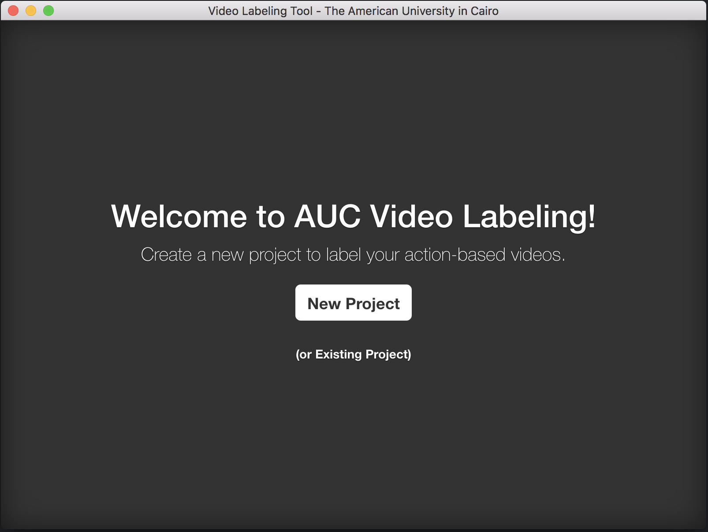
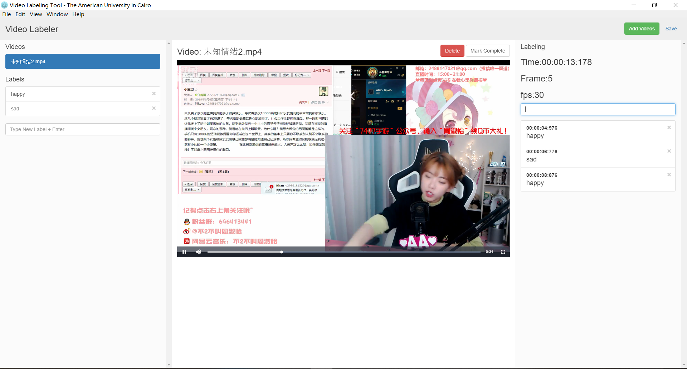

# Video Label Tool

## Introduction

In this tool, you could add your videos, and then, label them. The output of this tool is an `*.aucvl` file (which is nothing more than a json file containing the application state).

## Stack

This application is built on top of Electron and AngularJS. Thus, it is usable on Windows, Linux, and Mac.

## Installation

### 0. Prerequisites

You should have `Node` and `NPM` installed on your machine.

### 1. Clone the repository
```
git clone https://github.com/LittleFlyers/VideoLabelTool.git
```

### 2. Install the dependencies
```
npm install
```
### 3. Install FFmpeg
In Windwos,you should install the FFmpeg and set environment variables.
Then,install fluent-ffmpeg
```
npm install fluent-ffmpeg --save
```
### 4. Run the application
```
npm run start
```

## Preview

### Home Page



### Labeling Page


"# VideoLabelTool" 
